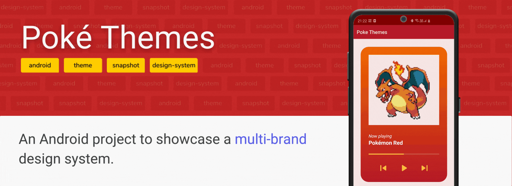

## Table of contents
1. [Introduction](#introduction)
2. [Structure](#structure)
3. [Architecture](#architecture)
4. [Implementation](#implementation)
5. [Roadmap](#roadmap)

## Introduction
This is an Android showcase project based on Pokémon.

The main goals of this project were to:
- Show how to create a design system compatible with multi-brand themes.
- Try [Paparazzi](https://github.com/cashapp/paparazzi), an open source snapshot testing library developed by [Cash App](https://github.com/cashapp) team.

I chose to use Pokémon as an example because it was the perfect case of a multi-brand theme usage.</br>
Since the first generation of games were released, they always used the idea of creating basically one base game, but with different themed variants for the game's boxes and cartridges, as well as some other contents.

## Structure
```
.
├── app                   # Project sample (android-application)
├── buildSrc              # Dependency management with Kotlin DSL
├── component             # Design system components (android-libraries)
│   └── player
└── theme
    ├── base              # Base theme and attributes (android-library)
    └── brand             # Brand theme implementations (android-libraries)
        ├── blue
        ├── green
        ├── red
        └── yellow
```

## Architecture


For the purpose of creating an actual sample, the project presents just one **android-application** module, which implements all four themes.

In the image above, it is presented a scenario where multiple apps were meant to be created, each one of them with its respective theme. In a real project, this would most likely be the case.

## Implementation
This is a multi-module project and each piece have its own responsibility.

### theme:base


Defines the [custom attributes](https://developer.android.com/training/custom-views/create-view#customattr) to be implemented by the [theme:brand](#theme-brand) modules, as well as its base [Android theme](https://developer.android.com/guide/topics/ui/look-and-feel/themes).</br>
These attributes are like an interface: it doesn't have a value on its own, but defines a sort of contract to be implemented by whoever uses it.

```xml
<resources>
    <attr name="colorPrimary" format="color" />
</resources>
```

### theme:brand:<_name_>
Implements the [custom attributes](https://developer.android.com/training/custom-views/create-view#customattr) declared in the [theme:base](#theme-base) module.</br>
Each theme may have its own values, based on the design identity of given variant.

```xml
<resources>
    <style name="PokemonRedTheme" parent="PokemonBaseTheme">
        <item name="colorPrimary">#c62828</item>
    </style>
</resources>
```

### component:<_name_>
Creates an [Android custom view](https://developer.android.com/guide/topics/ui/custom-components). Since this view is meant to be part of a multi-brand design system, it should almost always use the [custom attributes] from the [theme:base](#theme-base), rather than setting hardcoded values.

```xml
<gradient
    android:angle="?attr/angleGradient"
    android:endColor="?attr/colorPrimary"
    android:startColor="?attr/colorPrimaryVariant" />
```

## Roadmap
- Add [Compose](https://developer.android.com/jetpack/compose).
